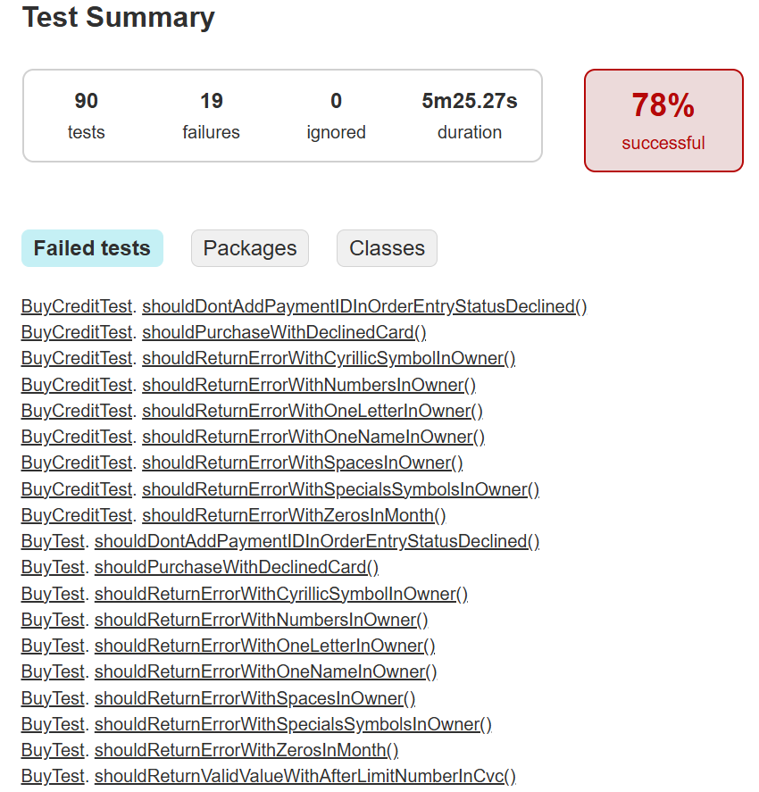

## Отчет по тестированию веб-приложения в рамках дипломного проекта
### Приложение: "Путешествие дня"
### Цель: 
Функциональное тестирование. UI-тесты. Проверка взаимодействия сервиса с базой данный.

### Период: 
23.07.2025 - 21.08.2025
### Сводка результатов: 
Выполнено тестов: 90, Пройдено: 71 (79%), упало: 19 (21%), Обнаружено дефектов: 8.
### Дефекты:
https://github.com/Vera1744/diplom/issues
Серьезность: Критический.

### Рекомендации: 
1. Исправить критический дефект https://github.com/Vera1744/diplom/issues/3 - принятие банком отклоненной карты.
2. Исправить верификацию поля Владелец.
3. Добавить test-метки элементам страницы веб-сервиса для дальнейшей работы.
4. Разработать техническую документацию для дальнейшего тестирования.

Отчет gradle:
